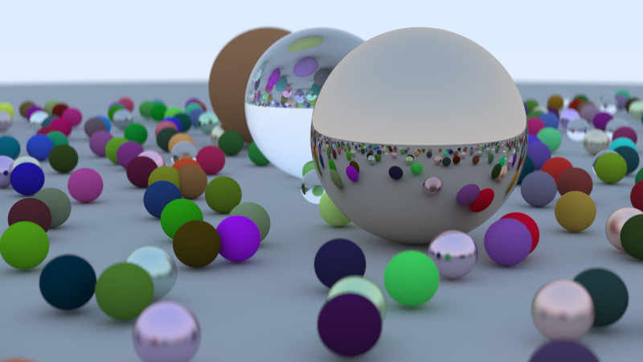

## Ray tracing in one weekend 
### written in [Rust](https://www.rust-lang.org/)

[Link to original book](https://raytracing.github.io/books/RayTracingInOneWeekend.html)

Run app with `cargo run`. Wait till the process ends and see the result in `Image.png` file. It will look similiar to this one.

Uses:

* [indicatif](https://crates.io/crates/indicatif) for progressbars
* [rayon](https://crates.io/crates/rayon) for parallelism
* [config](https://crates.io/crates/config) and [lazy_static](https://crates.io/crates/lazy_static) for work with settings

also:
* [colored](https://crates.io/crates/colored) and [rand](https://crates.io/crates/rand) for you never guess...
